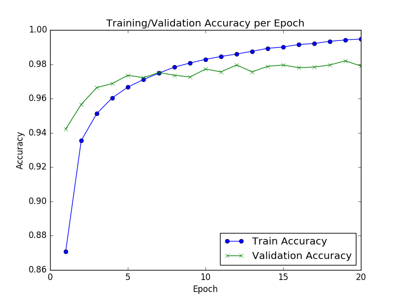

Report for Keras FNN
==============
This code aimed to train a FNN to recoginize the digits from MNIST handwritten dataset.

[MNIST database of handwritten digits](http://yann.lecun.com/exdb/mnist/)

Based on [Keras](https://keras.io/)

## How the pre-processing would affect training accuracy
* Min-Max Normalize value to [0,1]

