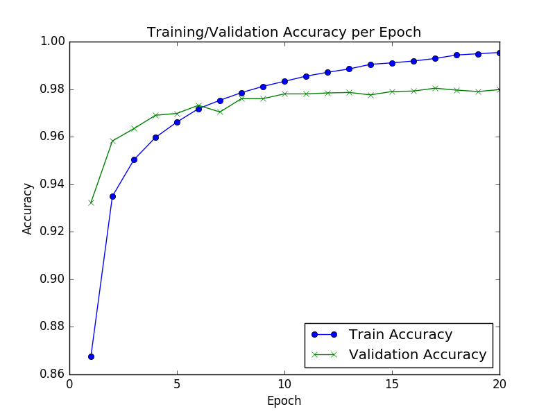
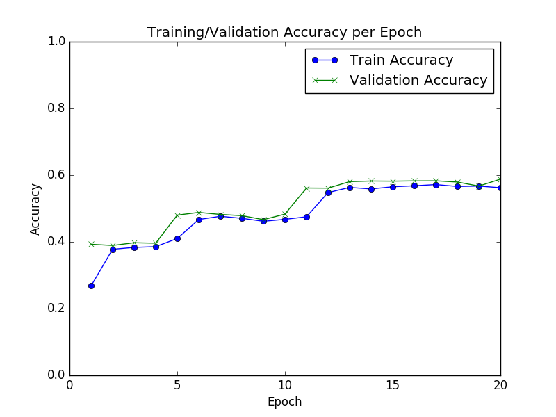
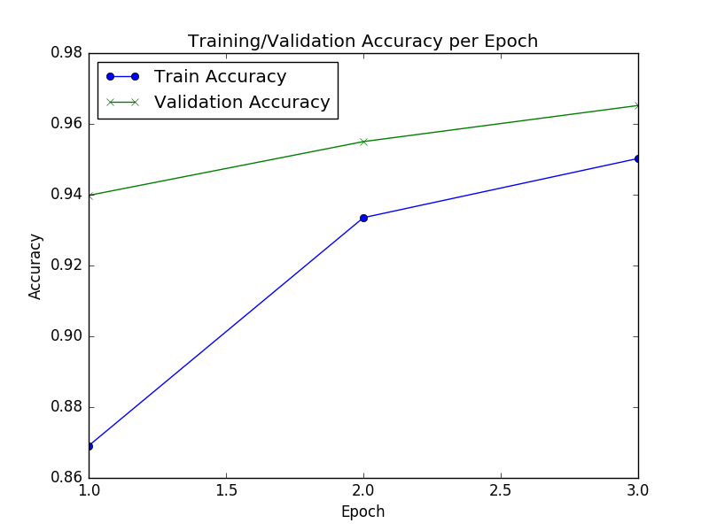
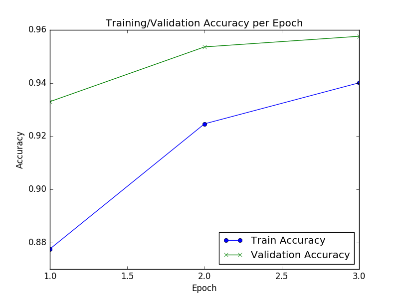
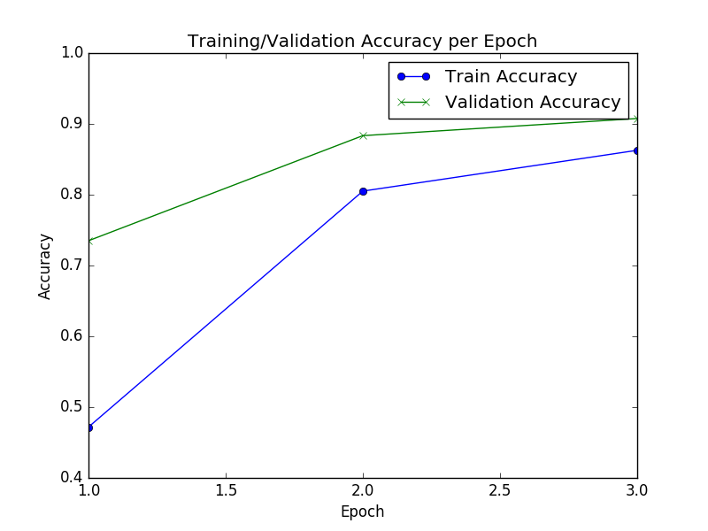

Report for Keras FNN lab
==============
Train a FNN to recoginize the digits from MNIST handwritten dataset.

[MNIST database of handwritten digits](http://yann.lecun.com/exdb/mnist/)

Based on [Keras](https://keras.io/)

## How the pre-processing would affect training accuracy
* Min-Max Normalize value to [0,1]
* Min-Max Normalize value to [-1,1]
* With no normalization [0, 255]

## How the activation function would affect training accuarcy

* Relu
* Tanh
* Sigmoid

